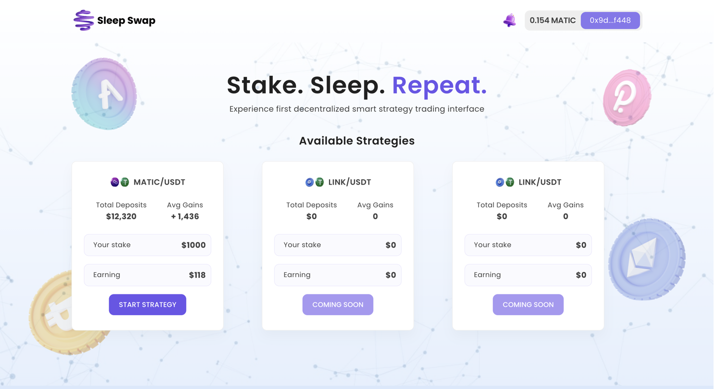

# SleepSwap - Trade And Yeild While You Sleep

Trade your crypto tokens through customised strategies and yeild more returns.

Following features are developed:

1. Authentication using Moralis
2. Read/Write Transaction Methods using Moralis
3. Stake In Pool Section
4. UI/UX design using Figma
5. Components using Material UI and Bootstrap.

Runs the app in the development mode.\
Open [http://localhost:3000](http://localhost:3000) to view it in the browser.

The page will reload if you make edits.\
You will also see any lint errors in the console.

## Available Scripts

In the project directory, you can run:

### `yarn start`

Runs the app in the development mode.\
Open [http://localhost:3000](http://localhost:3000) to view it in the browser.

The page will reload if you make edits.\
You will also see any lint errors in the console.
